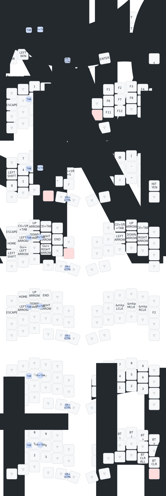

# zmk-config-roBa

## roBa ファームウェア書き込み
settings_reset-seeeduino_xiao_ble-zmk.uf2は[ここ](https://zmk.dev/docs/troubleshooting/connection-issues#split-keyboard-halves-unable-to-pair)にあるように分割キーボードのペアリングに関する問題を解決するための設定初期化用のファームウェアです。

1. PCと左側のマイコンをUSBで接続します。キーボードの電源はオフで大丈夫。  
2. マイコンのリセットボタンを2回押すと、「XIAO SENSE」という名前でUSBドライブとして認識される。 (ブートローダの起動)  
3. 「XIAO SENSE」ドライブにsettings_reset-seeeduino_xiao_ble-zmk.uf2をドラッグアンドドロップ。  
4. 書込み完了すると、「XIAO SENSE」というドライブは消えますが、再度セットボタンを2回押し、ブートローダを起動します。  
5. 「XIAO SENSE」ドライブにroBa_L-seeeduino_xiao_ble-zmk.uf2をドラッグアンドドロップします。  
6. 右側も同様の手順でsettings_reset-seeeduino_xiao_ble-zmk.uf2とroBa_R-seeeduino_xiao_ble-zmk.uf2を順番に書き込みます。  
7. 両方の書込みが完了したら、電源を入れ、それぞれのマイコンのリセットボタンを**1回**押します。  
8. PCでbluetoothデバイスとして「roBa」が認識され接続できればOKです。  

ファームウェアでは以下のような接続方式になっているのでロータリーエンコーダ側はPCに有線接続してもキーボードとして動作しません。  
+ ロータリーエンコーダ側(ペリフェラル) ⇔ (無線接続) ⇔ トラックボール側(セントラル) ⇔ (無線or有線接続) ⇔ PC  

## key-map edit

1. [KeymapEditor](https://nickcoutsos.github.io/keymap-editor/)にアクセス  
2. 「Login with GitHub」からでログインし、「Authorize Keymap Editor」を選択  
3.  画面左上の「Save」を押すと、編集したキーマップが適用されてGitHub Actionsが走り、自動的にビルドが開始  
4.  「Save」の隣に表示される「Latest」をクリックするとGitHubに移動し、ビルドが完了するとファームウェアがダウンロードできるようになります。  
5. 書き込み手順に従い書き込む  
    + キーマップの編集のみの場合はトラックボール側(セントラル)のみを書き換えることで変更が適用されます。  
    リセットファームウェアの書込みも基本的には必要ありません。  
    + KeymapEditorを用いずにroBa.keymap以外のファイルの内容を書き換えた場合は、左右のファームウェアを書き換えてください。  
    + **ファームウェアを書き直した際は、PC側のペアリング情報も削除してから再度ペアリングを行ってください。**  

## key-map

※numlayerのJIS配列版はlayer7にあります  
※functionlayerの左手中指と人差し指のキーは、上から順に{([です。  

## zmk firmwareについて
このキーボード固有の問題ではなくファームウェアのカスタマイズ等で疑問点がある場合、以下が参考になると思います。  
+ [公式ドキュメント](https://zmk.dev/)  
  + かなり丁寧に作りこまれているので基本的な設定はドキュメント見ればわかると思います。  
+ [zmk firmware Discordサーバ](https://zmk.dev/community/discord/invite)  
  + 活発に動いているので質問すると誰かしら回答くれることが多いです。

## その他参考資料
- [オートマウスレイヤー](https://zenn.dev/kot149/articles/zmk-auto-mouse-layer)
- [キーマップエディター](https://sensai-gadget.com/keymap-editor-usage/)
